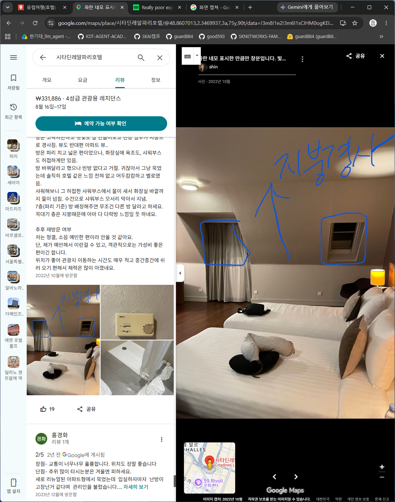

# EuropeTravel

# 1. 호텔 히랄다 센터

> - 인종차별있음
> - 장애인호실과 ,엘리베이터 엽호실 피하면 좋음

---

호텔 히랄다 센터(Hotel Giralda Center)는 전체적인 평점이 매우 높은 숙소이지만, 최근 1년 이내 작성된 저평점(1~3점대) 리뷰들을 살펴보면 서비스 디테일과 수영장 이용에 관한 공통적인 불만 사항들이 확인됩니다. 이를 바탕으로 체크인 시 팁과 주의점을 정리해 드립니다.

### 📉 최근 1년 이내 주요 불만 사항 (저평점 후기 요약)

1. **객실 청소(하우스키핑) 지연 및 위생 아쉬움:** 방 청소가 오후 3~4시 늦게까지 이루어지지 않아 일정 후 땀 흘리고 돌아왔을 때 불쾌했다는 후기가 있습니다. 또한, 사용한 와인 버킷이나 컵이 제대로 치워지지 않거나 침구류 얼룩에 대한 프론트의 대처가 미흡했다는 지적이 최근 1년 사이 제기되었습니다.
2. **무료 생수 및 기본 비품 부족:** 4성급 호텔임에도 매일 무료 생수가 제공되지 않았다는 불만이 많습니다. 슬리퍼나 티슈 박스 같은 기본 비품도 객실에 비치되어 있지 않아 따로 여러 번 요청해야 했다는 투숙객의 의견도 있었습니다.
3. **루프탑 수영장 혼잡 및 매너 문제:** 루프탑 수영장의 선베드 공간에 그늘이 부족하고, 아침 일찍부터 수건을 올려두고 자리를 선점(예약)하는 얌체 투숙객들 때문에 빈자리를 찾기 힘들었다는 평이 있습니다. 더불어 수영장에서 흡연과 음주를 하는 이들 때문에 아이와 함께하기 불편했다는 리뷰도 존재합니다.
4. **엘리베이터 보안 및 배수구 냄새:** 객실 층을 오가는 엘리베이터가 별도의 객실 카드키 태깅 없이도 작동하여 보안 측면에서 아쉬움을 느꼈다는 불만이 있습니다. 또한 화장실 세면대 배수구에서 냄새가 유독 강하게 올라왔다는 후기도 있었습니다.

---

### 💡 체크인 시 (또는 사전) 요청하면 좋은 사항

* **기본 비품 미리 요청:** 방에 올라간 뒤 다시 전화로 요청하기 번거로우므로, 체크인 수속을 할 때 프론트 직원에게 "객실에 슬리퍼와 티슈 박스를 넉넉히 챙겨달라"고 미리 말씀해 두시는 것이 좋습니다.
* **조용한 고층 객실 배정:** 도로의 차량 소음을 피하고 배수구 냄새 등의 고질적인 이슈를 최소화하기 위해 '조용한 고층(Quiet and high floor)' 배정을 강력하게 어필해 보세요.
* **오전 중 하우스키핑 요청:** 늦은 오후까지 방이 정리되지 않는 불편을 방지하려면, 아침 외출 전 프론트에 들러 "오전 중에 객실 청소를 마쳐달라"고 코멘트를 남겨두시면 한결 쾌적하게 쉴 수 있습니다.

* **슬리퍼와 전기포트(Kettle) 확인:**
유럽의 호텔은 4성급이라도 객실 내 무료 슬리퍼가 없는 경우가 많습니다. 또한, 컵라면이나 따뜻한 차를 드실 계획이라면 객실에 전기포트가 있는지 확인하시고 없다면 프론트에 챙겨 달라고 요청하세요.
---

### ⚠️ 투숙 시 주의할 점

* **수영장 이용 시간대 눈치 게임:** 호텔 수용 인원에 비해 수영장 규모가 크지 않고 자리 선점 경쟁이 치열하므로, 수영이나 일광욕을 여유롭게 즐기시려면 사람들이 붐비지 않는 이른 오전 시간대나 아예 식사 시간대를 노리시는 것이 유리합니다.

* **객실 내 귀중품 보관 철저:** 엘리베이터 보안이 다소 허술하게 느껴질 수 있으니, 외출하실 때는 현금이나 여권 등 귀중품을 반드시 객실 내 금고에 보관하시고 캐리어는 잠금장치를 채워두는 등 자체 보안에 각별히 신경 쓰셔야 합니다.

* **호텔 내 차별은 안심, 길거리 치안은 주의:**
호텔 리셉션 직원들은 영어가 능통하고 글로벌 스탠다드에 맞춘 프로페셔널한 응대를 하므로 **숙소 내에서의 인종차별이나 불친절은 전혀 걱정하지 않으셔도 됩니다.**
다만, 호텔 밖 메인 관광지(세비야 대성당, 스페인 광장 등)에서는 동양인 관광객이 현금을 많이 소지하고 있다는 인식 때문에 **소매치기의 1순위 타겟**이 됩니다. 특히 나뭇가지(로즈마리)를 건네며 접근하는 집시 여성들은 무조건 단호하게 무시하고 지나가셔야 합니다.
* **길거리의 가벼운 캣콜링(인종차별) 대처:**
스페인 남부 특성상 거리를 걷다 보면 지나가는 현지인이나 10대들이 "니하오"라고 부르는 등 무례한 행동을 할 때가 있습니다. 불쾌하시겠지만, 감정적으로 대응하기보다는 가볍게 무시하고 안전하게 일정을 소화하는 것이 가장 좋습니다.
* **관광지와의 거리 및 무더위:**
호텔에서 세비야 대성당이나 알카사르 같은 메인 구시가지까지는 도보로 약 15~20분 정도 걸립니다. 현재 8월의 세비야는 스페인 내에서도 가장 뜨거운 한여름 폭염(40도 육박)이 이어지는 시기입니다. 무리한 도보 이동보다는 한낮에는 우버/볼트(Bolt) 같은 차량 호출 앱이나 트램을 적극적으로 활용하시길 권장합니다.
* **무료 생수 미제공:**
체크인 첫날을 제외하고는 연박 시 무료 생수가 매일 채워지지 않는 경우가 많습니다. 호텔 길 건너편이나 근처에 대형 마트가 있으니, 일정 후 들어오실 때 물과 간식을 미리 넉넉히 사두시면 편리합니다.

# 2. 푸에르타 카테드랄 스위트(Puerta Catedral Suites)

푸에르타 카테드랄 스위트(Puerta Catedral Suites)는 환상적인 뷰와 위치 덕분에 전체적인 평점은 매우 높지만, 최근 1년 내외의 투숙객 후기를 살펴보면 아파트먼트(무인) 형태의 숙소 특성과 위치에서 비롯된 명확한 불만 사항들이 존재합니다. 이를 바탕으로 요청 사항과 주의점을 정리해 드립니다.

### 📉 최근 1년 이내 주요 불만 사항 요약

* **모바일 키 오류 및 접속 지연:** 리셉션이 없어 앱을 통한 디지털 도어록 시스템으로 셀프 체크인을 해야 하는데, 모바일 키 인식이 잘 안 되거나 특정 고층 객실에서는 공용 테라스 문과 블루투스 신호가 겹쳐 문을 열기 위해 수십 번을 시도해야 했다는 후기가 있습니다.
* **호텔식 서비스 부재 및 고객센터 시간제한:** 고객센터(메신저) 운영 시간이 정해져 있어(통상 09:30~17:30), 야간에 헤어드라이어 고장이나 화장실 온수 미작동 등의 시설 문제가 발생했을 때 외주 콜센터로 연결되어 즉각적인 조치나 보수를 받기 어려웠다는 불만이 있습니다.
* **저층 객실의 소음 및 사생활 보호 취약:** 메인 도로와 광장에 인접해 있어 늦은 밤까지 밖에서 부르는 노래나 소음이 들려 수면을 방해받았다는 평이 있습니다. 또한 객실 방음이 다소 약하고(특히 청소 직원실 앞 객실), 창문 유리가 투명하여 외부에서 내부가 들여다보이기 때문에 낮에도 커튼을 치고 지내야 하는 불편함이 제기되었습니다.
* **뷰의 한계 및 어두운 조명 (저층부):** 1층(한국 기준 2층) 등 낮은 층에 배정받을 경우 웅장한 뷰 대신 대성당의 벽만 보여 아쉬웠다는 후기와, 객실 전반의 조도가 낮아 밤에는 꽤 어둡게 느껴진다는 의견이 있습니다.

---

### 💡 체크인 시 (또는 사전) 요청하면 좋은 사항

1. **고층 객실(High Floor) 1순위 요청:** 저층에서 발생하는 뷰의 한계, 사생활 침해, 길거리 소음 문제를 한 번에 줄일 수 있는 가장 확실한 방법입니다. 예약 메시지나 체크인 전 연락을 통해 고층 배정을 꼭 어필하세요.
2. **비상용 '실물 카드키' 여부 확인:** 모바일 키 오류로 당황할 수 있으므로, 객실 입실 후 내부에 비치된 실물 카드키가 있는지 먼저 확인하시고 외출 시에는 모바일 기기와 카드키를 함께 소지하고 다니시는 것이 안전합니다.
3. **여분의 수건 및 어메니티 사전 요청:** 관리자 퇴근 후 밤에는 추가 물품을 받기 어렵습니다. 입실 직후 머무는 기간 동안 필요한 수건이나 휴지가 충분한지 확인하고, 부족하다면 고객센터 운영 시간 내에 넉넉히 요청해 두세요.

---

### ⚠️ 투숙 시 주의할 점

1. **체크인 앱 설치 및 절차 사전 완료:** 도착 후 숙소 문 앞에서 데이터나 와이파이를 연결해 앱을 깔고 인증을 시도하면 진땀을 뺄 수 있습니다. 메일이나 메신저로 안내받은 온라인 체크인 및 앱 설치 절차를 입국 전이나 이동 중에 미리 완료해 두셔야 합니다.
2. **입실 직후 주요 시설(온수/드라이기) 즉시 테스트:** 밤에 씻으려다 뜨거운 물이 나오지 않거나 드라이기가 고장 나면 꼼짝없이 불편을 겪어야 합니다. 입실하자마자 세면대와 샤워기의 온수, 에어컨 작동 상태 등을 테스트하고 이상이 있다면 즉시 관리자에게 메신저를 보내 조치를 받으세요.
3. **문 밖 소매치기 각별히 주의:** 숙소 입구를 나서는 순간 세비야에서 소매치기가 가장 많은 대성당 앞 광장입니다. 특히 체크인을 위해 숙소 건물 밖에서 짐을 세워두고 핸드폰으로 앱을 조작하는 순간이 범죄의 가장 쉬운 타겟이 되므로, 소지품에 절대 눈을 떼지 마시기 바랍니다.

# 3.호텔 리우 플라자 에스파냐(Hotel Riu Plaza España)

호텔 리우 플라자 에스파냐(Hotel Riu Plaza España)의 최근 1년(2025~2026년) 구글 지도 및 주요 예약 플랫폼의 저평점(1~2점대) 리뷰들을 종합해 보면, 이 호텔의 고질적인 문제인 '혼잡도'와 더불어 '냉난방 시스템'에 대한 불만이 새롭게 눈에 띕니다.

이를 바탕으로 실제 투숙 시 피가 되고 살이 될 요청 사항과 주의점을 정리해 드립니다.

---

### 📉 최근 1년 이내 주요 불만 사항 (저평점 후기 요약)

**1. "최악의 엘리베이터 대기 지옥" (가장 많은 지분)**
객실이 600개에 육박하는 데다 27층 루프탑 바를 방문하는 외부 관광객까지 섞여, 체크아웃(오전 11시~12시)이나 일몰 피크 타임에는 엘리베이터를 타는 데만 15~30분이 걸렸다는 분노 섞인 후기가 가장 많습니다. 엘리베이터를 몇 대씩 그냥 보내야 했다는 불만이 압도적입니다.

**2. 환절기 중앙 냉난방 시스템 문제 (최근 두드러짐)**
최근 후기 중 "가을/겨울로 넘어가는 시기인데 호텔 측에서 중앙 난방을 아직 켜지 않아 밤에 방이 너무 추웠다(작은 온풍기 하나만 줬다)"거나, 반대로 "더운 날 에어컨이 약하다"는 등 중앙 제어식 냉난방 시스템의 유연성 부족을 지적하는 리뷰가 눈에 띕니다.

**3. 도떼기시장 같은 로비와 체크인 지연**
오후 3시 체크인 시간에 대형 단체 관광객과 일반 투숙객이 겹쳐 대기 줄이 놀이공원처럼 길게 늘어섰다는 불만이 많습니다. 직원들이 바쁘다 보니 응대가 다소 기계적이었다는 의견도 있습니다.

**4. 저층부의 치명적인 소음**
마드리드 최대 번화가인 스페인 광장과 그란 비아 대로변에 위치해 있다 보니, 저층을 배정받은 투숙객들은 밤늦게까지 이어지는 차 소리, 사이렌 소리, 광장 인파 소음 때문에 잠을 설쳤다는 평이 많습니다.

---

### 💡 체크인 시 (또는 사전) 요청하면 좋은 사항

**1. 무조건 "고층(High Floor)" 배정 강력 어필**
도로와 광장 소음을 완벽히 차단하고 훌륭한 전망을 얻기 위해 1순위로 요청해야 합니다. 뷰의 경우 **"마드리드 왕궁(Royal Palace) 뷰"** 또는 "그란 비아(Gran Vía) 뷰"가 가장 인기가 좋으니 고층과 함께 요청해 보세요.

**2. 루프탑 '패스트트랙' 입장 방법 및 전용 엘리베이터 확인**
투숙객은 외부인이 길게 줄을 서는 27층 루프탑 바에 무료 및 우선 입장(Fast track)이 가능합니다. 체크인 시 투숙객 전용 엘리베이터의 위치와 입장 확인 방식(카드키 제시 등)을 명확하게 안내받으세요.

**3. 슬리퍼 및 부족한 비품 선제적 요청**
4성급임에도 방에 무료 슬리퍼가 비치되지 않은 경우가 잦습니다. 방에 올라갔다 물건이 없어 다시 내려오려면 엘리베이터 때문에 매우 고통스러우니, 체크인 수속 시 프론트에 "객실에 슬리퍼를 올려달라"고 미리 요청해 두는 것이 현명합니다.

---

### ⚠️ 투숙 시 주의할 점 (단점 대비 및 치안)

**1. 외출 및 체크아웃 시 시간 여유 두기**
엘리베이터 병목 현상 때문에 낭패를 볼 수 있습니다. 공항으로 이동하거나 예약해 둔 투어(톨레도, 세고비아 등)가 있다면, 평소보다 **최소 20~30분 일찍 객실에서 출발**하셔야 안전합니다.

**2. 입실 직후 방 온도 체크하기**
방에 들어가자마자 냉/난방이 제대로 작동하는지부터 테스트하세요. 만약 온도가 맞지 않거나 중앙 제어로 인해 원하는 만큼 조절되지 않는다면, 즉시 프론트에 연락해 선풍기나 이동식 온풍기(히터) 등 대체 기구를 방으로 가져다 달라고 요구하셔야 밤에 고생하지 않습니다.

**3. 문 밖 스페인 광장 소매치기 초경계**
호텔 내부는 쾌적하고 안전하지만, 문을 나서자마자 펼쳐지는 스페인 광장 일대는 마드리드 소매치기들의 주 활동 무대입니다. 호텔 앞에서 건물을 배경으로 사진을 찍느라 정신이 팔린 관광객(특히 동양인)은 1순위 타겟이 되니 핸드폰과 가방을 항상 몸에서 떼지 마세요.

**4. 수영장에 대한 기대치 낮추기**
인피니티 풀 스타일의 야외 수영장이 있지만, 600개 객실 규모에 비하면 크기가 '대형 목욕탕' 수준으로 꽤 작습니다. 한여름 피크 타임에는 물 반 사람 반일 확률이 높으니, 수영을 제대로 즐기시려면 아침 일찍 방문하시는 것을 권장합니다.

# 4.H10 우르키나오나 플라자

> - 패밀리룸 중에 저층인경우 하수구냄세,
> - 1층은 반지하임,지하철소음이 날수있으므로 고층을 요구 하여야함

---
스페인 바르셀로나의 **H10 우르키나오나 플라자(H10 Urquinaona Plaza)** 호텔 최근 1년 이내 구글 지도 및 예약 플랫폼의 저평점(1~3점대) 리뷰를 바탕으로, 주요 불만 사항과 체크인 시 팁, 주의점을 정리해 드립니다.

---

### 📉 최근 1년 이내 주요 불만 사항 (저평점 후기 요약)

1. **방음 문제 및 외부 소음 (도로변 객실):** 우르키나오나 광장과 대로변에 위치해 있다 보니, 창문이 이중창이 아닌 저층이나 길가 쪽 객실에 배정된 투숙객들은 밤늦게까지 이어지는 차량 소음이나 광장 인파 소리 때문에 잠을 설치기 일쑤였다는 불만이 제기되었습니다.
2. **매우 협소한 루프탑 수영장:** 인스타그램이나 사진으로 볼 때는 멋진 인피니티 풀 같지만, 실제로는 가볍게 발을 담그는 수준의 미니 플런지 풀(Plunge Pool)이라 "수영장이라 부르기 민망할 정도로 작다"는 실망 섞인 후기가 많습니다.
3. **간헐적인 샤워실 배수 불량 및 시설 노후화:** 객실 컨디션이 대체로 좋지만, 일부 객실에서 샤워부스 물이 잘 빠지지 않거나 세면대 배수구에서 냄새가 올라왔다는 지적이 있었습니다. 또한 부티크 호텔 특성상 객실 공간 자체가 아주 널찍한 편은 아닙니다.
4. **조식 바쁜 시간대의 혼잡도:** 조식 퀄리티는 평이 좋지만, 투숙객이 몰리는 피크 시간대(오전 8시~9시 사이)에는 자리가 부족해 대기해야 하거나 음식 채워지는 속도가 다소 더뎌 아쉬웠다는 의견이 있었습니다.

---

### 💡 체크인 시 (또는 사전) 요청하면 좋은 사항

1. **안쪽의 조용한 고층 객실 요청 (Quiet Room & High Floor):** 도로 소음과 방음 문제를 사전에 예방하기 위해 예약 메시지나 체크인 시 "광장 쪽이 아닌 안쪽을 향하는 조용한 고층 객실"로 배정해 달라고 강력히 어필하세요.
2. **웰컴 드링크(카바) 및 기념일 혜택 확인:** 체크인 시 스파클링 와인(카바)이나 웰컴 티를 제공하는 경우가 많습니다. 특별한 기념일(허니문, 생일 등)이라면 체크인 때 살짝 언급하여 기분 좋은 서비스를 챙겨보세요.
3. **이른 체크아웃 시 '조식 피크닉(도시락)' 신청:** 귀국일이나 근교 투어 일정으로 조식당 오픈 시간보다 일찍 나간다면, 전날 프론트에 미리 말해 빵과 음료가 담긴 **테이크아웃 조식 박스**를 꼭 챙겨달라고 요청하세요.

---

### ⚠️ 투숙 시 주의할 점 (치안 및 시설)

1. **호텔 문 밖은 소매치기 초위험 구역:** 호텔이 위치한 우르키나오나 광장~카탈루냐 광장 일대는 바르셀로나에서도 관광객을 노린 소매치기들이 가장글끓는 곳입니다. 호텔 문을 나서는 순간부터 스마트폰을 손에 쥐고 걷거나 테이블 위에 올려두는 행동은 절대 금물이며, 가방은 항상 몸 앞으로 단단히 사수하셔야 합니다.
2. **바르셀로나 도시세(City Tax) 현장 결제:** 숙박 플랫폼에서 숙박 요금을 전액 결제했더라도, 바르셀로나의 1박당 관광세(도시세)는 별도입니다. 체크인 또는 체크아웃 시 카드로 추가 결제해야 하니 당황하지 않도록 미리 염두에 두세요.
3. **수영장에 대한 기대치 낮추기:** 수영을 목적으로 방문하면 크게 실망할 수 있으니, 수영장보다는 '루프탑 바에서 마시는 시원한 칵테일과 전경'을 즐기는 용도로 생각을 바꾸시는 것이 정신 건강에 좋습니다.

# 5. 베일 스위트(Vale Suites)

> - 13시쯤 체크인가능

바르셀로나 에이샴플레(Eixample) 지구에 위치한 베일 스위트(Vale Suites)를 예약하셨군요! 이 지역은 바르셀로나 내에서도 고급 상점과 훌륭한 레지던스들이 모여 있어 치안이 좋고, 맛집과 주요 관광지로 이동하기에도 매우 좋은 훌륭한 선택입니다.

전통적인 호텔이 아닌 '아파트먼트(레지던스)' 형태의 숙소이기 때문에, 체크인 전후로 꼭 알아두셔야 할 꿀팁과 주의점(바르셀로나의 동양인 타겟 범죄 포함)을 명확하게 정리해 드립니다.

---

### 💡 체크인 시 (또는 사전) 요청하면 좋은 것

* **비대면 체크인 방법 및 출입 비밀번호 사전 확보 (매우 중요):**
베일 스위트는 24시간 상주하는 전통적인 리셉션 데스크가 없을 수 있습니다. 대부분 **전자 도어록(Passcode)을 이용한 비대면 출입 시스템**을 사용하므로, 체크인 1~2일 전 이메일이나 왓츠앱(WhatsApp)으로 오는 '건물 공동 현관 및 객실 출입 비밀번호'를 반드시 캡처해 두세요. 문제가 생겼을 때 즉각 소통할 수 있는 관리자의 메신저 연락처도 꼭 받아두셔야 합니다.
* **객실 위치에 따른 뷰 vs 소음 선택:**
숙소가 위치한 곳은 넓은 도로(Carrer de València)가 있는 바둑판 형태의 도심입니다. 도로변을 향하는 창문은 개방감이 좋지만 차량 통행 소음이 들릴 수 있습니다. 잠자리에 예민하신 편이라면 사전에 "건물 안쪽(중정/Courtyard)을 향하는 조용한 객실"로 배정해 달라고 요청해 보세요.
* **수건 및 소모품 넉넉히 요청하기:**
일반 호텔처럼 매일 무료로 룸 클리닝을 해주고 수건을 갈아주지 않는 경우가 많습니다(예약 조건에 따라 다르거나 추가 비용 발생). 체크인 시 직원을 만나게 된다면, 여분의 수건이나 화장지, 캡슐 커피 등을 미리 넉넉하게 요청해 두시면 머무는 내내 훨씬 편리합니다.

---

### ⚠️ 투숙 및 이동 시 주의할 점 (인종차별 및 치안 포함)

* **안전하고 부유한 동네지만, '소매치기'는 최우선 경계:**
에이샴플레 지역은 람블라스 거리나 고딕 지구의 좁고 어두운 골목들에 비하면 훨씬 쾌적하고 안전한 동네입니다. 하지만, 근처에 가우디 건축물(까사 바트요 등)과 명품 거리가 있어 부유한 관광객을 노리는 전문 소매치기들이 상주합니다. 특히 **동양인 관광객은 고가의 스마트폰과 현금을 많이 소지하고 있다는 인식 때문에 소매치기의 1순위 타겟**이 됩니다. 크로스백은 무조건 몸 앞으로 메시고, 야외 테라스 식당에서 테이블 위에 핸드폰을 올려두는 행동은 절대 금물입니다.
* **'가짜 경찰' 및 '이물질 투척' 사기 주의:**
이 지역 주변의 넓은 대로에서 종종 아시아인 여행객을 노린 사기 범죄가 발생합니다. 사복 경찰을 사칭하며 마약 검사를 핑계로 여권과 지갑을 요구하거나, 뒤에서 옷에 새똥이나 케첩 같은 이물질을 묻히고 닦아주는 척하며 지갑을 빼가는 수법입니다. 누군가 갑자기 과도한 호의를 베풀며 접근한다면 단호하게 "No!"를 외치고 자리를 피하셔야 합니다.
* **아파트 에티켓 및 뒷정리 규정:**
거주용 아파트와 비슷한 환경이기 때문에 늦은 밤 세탁기를 돌리거나 너무 큰 소리로 떠들면 이웃 투숙객에게 피해가 갈 수 있습니다. 또한, 주방 시설이 잘 되어 있는 만큼 체크아웃 시 설거지나 쓰레기 분리수거를 전혀 해두지 않으면 '청소 페널티'가 청구될 수 있으니 숙소 내 규정 안내문을 가볍게 읽어보시는 것이 좋습니다.
* **바르셀로나 도시세(City Tax) 별도 결제:**
바르셀로나의 모든 숙박 시설은 투숙객에게 1인당 1박 기준으로 도시세(관광세)를 부과합니다. 숙박 플랫폼에서 숙박비를 전액 결제했더라도 이 세금은 현지에서 따로 결제해야 하니 청구되더라도 당황하지 마시고 카드로 결제하시면 됩니다.

# 5.플로리드-에투알

> - 지저분하고 불친절(알랭은친절-맛집추천)
> - 슬리퍼 제공해주고, 청소 매일 해주시며 수건도 매일 갈아주세요.

파리 16구에 위치한 호텔 플로리드 에투알(Hotel Floride Étoile)은 에펠탑 접근성과 안전한 치안, 친절한 서비스로 전반적인 평점이 매우 높은 곳입니다. 하지만 최근 1년 이내(2024~2025년)의 아쉬운 후기들을 살펴보면, 파리의 오래된 건물 특성에서 비롯된 공통적인 단점들이 발견됩니다. 이를 바탕으로 주요 불만 사항과 투숙 팁을 정리해 드립니다.

### 📉 최근 1년 이내 주요 불만 사항 (저평점 및 아쉬운 점 요약)

1. **겨울철 난방 및 온도 문제:** 최근 후기 중 "방이 다소 춥고 서늘하게 느껴졌다", "겨울철에 객실 온도가 조금 더 높았으면 좋겠다"는 등 중앙 난방이나 온도 유지에 대한 아쉬움이 꾸준히 제기되었습니다.
2. **샤워 시 화장실 물 튐 현상:** 욕조가 있는 일부 객실의 경우, 샤워 커튼이나 유리 가림막이 절반만 있거나 아예 없어서 샤워 후 화장실 바닥 전체가 물에 젖어버린다는 구조적인 불만이 있습니다.
3. **방음 취약 (문 닫는 소리):** 옆 방의 소음보다는 복도에서 사람들이 지나다니는 소리나 아침에 다른 투숙객들이 '문 닫고 나가는 소리'가 방 안으로 꽤 잘 들린다는 지적이 있습니다.
4. **다소 좁고 예스러운 객실:** 파리의 전형적인 클래식 호텔이다 보니 방이 작아 대형 캐리어 여러 개를 동시에 활짝 펼쳐두기 버겁고, 인테리어가 약간 예스럽고(Dated) 오래된 느낌이 난다는 평이 있습니다.

---

### 💡 체크인 시 (또는 사전) 요청하면 좋은 사항

* **여분의 담요 사전 문의:** 추위를 많이 타시는 편이거나 겨울 및 환절기에 투숙하신다면, 체크인 시 프론트에 "방이 추울 경우 추가 담요(Extra blanket)를 받을 수 있는지" 미리 확인하고 받아두시는 것이 좋습니다.
* **"조용한 안쪽(Courtyard) 객실" 요청:** 대로변 소음과 복도 이동 소음을 최소화하기 위해 엘리베이터에서 멀거나 건물 안쪽(안뜰)을 향하는 끝방으로 배정해 달라고 요청하세요.
* **욕조/샤워부스 타입 확인:** 화장실 바닥이 젖는 것이 불편하시다면, 체크인 시 욕조 대신 가림막이 확실한 일반 샤워부스가 있는 방이 있는지 문의해 보시는 것도 하나의 방법입니다.

---

### ⚠️ 투숙 시 주의할 점

* **건식 화장실 사용 주의:** 샤워 가림막이 짧아 물이 밖으로 새기 쉬우므로, 샤워기 헤드의 방향을 벽 쪽으로 향하게 하고 조심해서 씻으셔야 화장실 바닥 미끄러짐 사고나 불편함을 예방할 수 있습니다.
* **캐리어 짐 풀기 요령:** 객실 바닥 공간이 넉넉하지 않으므로, 침대 위나 객실에 비치된 수하물 거치대를 적극 활용하여 짐을 세워두고 생활하시는 것이 통행에 유리합니다.
* **호텔 앞 '까르푸 시티' 적극 활용:** 치명적인 단점들을 상쇄하는 가장 큰 장점 중 하나로, 호텔 바로 앞(길 건너편)에 까르푸 마트가 위치해 있습니다. 파리의 비싼 물가를 고려해 일정 후 매일 들어오실 때 생수와 간단한 간식거리를 넉넉히 사두시면 아주 유용합니다.

# 6.시타딘레알파리호텔
> - 씨티뷰(씨끄러움) 혹은 정원뷰를 결정하여야함
> - city tax 영수증 잘보관해야함,체크아웃시 또 결제요구
> - 로비커피 무료로 먹을수있음 
> - 절대 안뜰 측의 방이어야합니다. 분수측의 방은, 적어도 조용함을 좋아하는 국민성의 일본인이 견딜 수 있는 소음은 아닙니다. 매일 밤 늦게까지, 
> ----와 누군가가 노래하거나 데모하거나, 뭔가 하고 있습니다.

> -고층 달라고 요청하긴 했는데 광장 아닌쪽으로 맨 꼭대기 층 줌.
> 처음엔 꼭대기층 좋다고 받았는데 막상 가보니 다락방 감옥 같은 분위기..
> 창문 코딱지만하고 햇빛도 잘 안들어오고 천장 일부가 지붕으로 경사짐. 뷰도 반대편 아파트 뷰..

파리의 최중심이자 완벽한 교통 인프라를 자랑하는 시타딘 레알 파리(Citadines Les Halles Paris)는 취사가 가능한 4성급 레지던스 호텔로 한국인 여행객들에게도 인기가 아주 높은 곳입니다.

하지만 최근 1년(2025~2026년) 이내의 리뷰 중 저평점 및 아쉬운 후기들을 종합해 보면, 대형 복합 쇼핑몰 및 광장과 인접해 있는 위치적 특성과 '아파트먼트' 형태의 한계에서 오는 명확한 불만 사항들이 존재합니다. 이를 바탕으로 체크인 팁과 주의점을 꼼꼼히 정리해 드립니다.

---

### 📉 최근 1년 이내 주요 불만 사항 (저평점 및 아쉬운 점 요약)

1. **겨울 및 환절기 난방 부족:** 호텔의 중앙/개별 보일러 최고 온도가 24도 정도로 제한되어 있어, 한국 투숙객들 사이에서 "방이 서늘하고 춥다"는 불만이 꾸준히 제기됩니다.
2. **잦은 엘리베이터 고장 및 대기 시간:** 엘리베이터가 2대뿐인데, 최근 기술적 결함 등으로 1대가 운행되지 않는 경우가 잦아 체크인/아웃 피크 타임에 대기 시간이 매우 길었다는 영문 후기들이 꽤 많습니다.
3. **광장 인파 및 심야 공사 소음:** 호텔이 파리 최대 상업 지구인 포럼 데 알(Forum des Halles)의 분수 광장 바로 앞에 위치해 있습니다. 창문을 열면 광장에 모인 사람들의 소음이 들리고, 간헐적인 심야 도로/건물 보수 공사 소리로 인해 수면을 방해받았다는 지적이 있습니다 (단, 이중창이 훌륭해 창문을 닫으면 방음은 우수합니다).
4. **객실 바닥 청결도 및 부실한 조식:** 카펫 또는 마루 바닥의 청소 상태가 아주 깨끗하지 못했다거나 욕실에서 이전 투숙객의 머리카락이 발견되었다는 등 청소 디테일에 대한 지적이 있습니다. 또한 조식의 가짓수가 적고 부실하다는 의견이 많습니다.

---

### 💡 체크인 시 (또는 사전) 요청하면 좋은 사항

1. **"조용한 안쪽(Courtyard) 객실" 또는 "센강 방향" 배정 요청:** 분수 광장의 심야 소음을 피하고 싶다면, 예약 메시지나 체크인 시 광장 쪽이 아닌 조용한 안뜰이나 반대편 뷰(Quiet courtyard view)로 배정해 달라고 강력히 어필하시는 것이 수면에 훨씬 유리합니다.
2. **여분의 담요 및 난방 기구 선제적 확보:** 추위를 많이 타신다면 체크인 시 프론트에 "방이 춥다"고 말씀하시고 추가 담요(Extra blanket)를 미리 넉넉히 받아두시길 권장합니다.
3. **무료 커피 서비스 이용 위치 확인:** 로비(1층)에서 투숙객을 위해 24시간 양질의 무료 커피와 핫초코 등을 제공합니다. 꼭 위치를 확인하시고 아침에 외출하실 때 적극 활용해 보세요.

---

### ⚠️ 투숙 시 주의할 점 (레지던스 특성 및 치안)

1. **하우스키핑(룸 청소) 제한 및 셀프 수건 교체:** 아파트먼트(레지던스) 호텔이므로 단기 투숙(보통 6박 이하) 시 매일 룸 클리닝이 무료로 제공되지 않습니다. 추가 수건, 화장지 교체, 쓰레기통 비우기 등은 투숙객이 1층에 마련된 비품실에서 직접 챙겨가거나 프론트에 요청해야 한다는 점을 꼭 인지하셔야 합니다.
2. **취사 후 기본 뒷정리:** 방 안에 인덕션, 전자레인지, 식기세척기 등 주방 시설이 아주 잘 갖춰져 있어 현지 마트에서 장을 보거나 한식(라면, 햇반 등)을 조리해 먹기 완벽합니다. 다만 체크아웃 시 설거지와 분리수거를 어느 정도 해두어야 청구될 수 있는 청소비 페널티를 피할 수 있습니다.
3. **레알(Les Halles) 역 주변의 야간 치안 경계:** 이 지역은 루브르 박물관, 퐁피두 센터까지 걸어갈 수 있고 RER 기차로 샤를 드골 공항까지 한 번에 연결되는 최고의 교통 요지입니다. 하지만 파리에서 유동 인구가 가장 많은 복합 환승 구역이라 **소매치기 범죄가 빈번하며 광장 주변에 노숙자도 꽤 많습니다.** 밤늦은 시간에는 너무 늦게까지 배회하지 마시고, 외출 시 스마트폰과 크로스백을 단단히 사수하셔야 합니다.